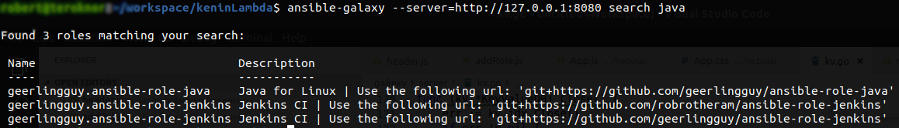

# Nebular
 A very basic ansible galaxy esc search engine. Does not require the use of any 3rd party api e.g github or bitbucket to work. Relies on simple git to pull the role scan it for the meta data and readme so it can be added to the database. 

 No external database is used nebular use a built in search engine powered by bleve https://github.com/blevesearch/bleve


## Screenshots


To add a new role to nebular click the + button (bottom left) and fill out the namespace (your username / organisation) and the repo name


Each role you can see the information along with the roles dependacies and versions it supports. It gets this information from reading the meta/main.yml file in the role repo


Nebular also has a markdown viewer so you can see the role documentation


Finally nebular has a tiny amount of the ansible galaxy api support enough only to do basic searches 



## Installation

###### Prerequisites:
 To build nebular you will need:
 go 1.11+
 npm 6.9.0 + or yarn

###### Server
nebular used the vendor folder for its dependacies. It makes it easiter to build in constrained enviroments;

> cd Server; 
go build -mod=vendor

###### UI
The Ui is a simple single page app built using React
> cd ui;
npm install

To start the dev server
>npm start

To build a production version that will get coppied to Server/public
>npm run build

###### Docker
To build the docker image
> docker build . -t nebular:latest


## Running
Nebular can be configured either by a config file placed in config/config.yaml or via enviromental varibles more ueseful if using docker
###### File
```
debug: true
port: "8080"
hostname: ""
git_user: ""
git_password: ""
git_tmp_dir: /tmp/nebular/repos
db_path: /tmp/nebular
user_ssh_url: true
git_ssh_server: 'git@github.com:'
default_git_server: http://github.com
default_git_namespace: robrotheram

```

###### Environment Varibles
```
NEBULAR_PORT
NEBULAR_HOSTNAME
NEBULAR_GIT_USER
NEBULAR_GIT_PASSWORD
NEBULAR_GIT_TMP_DIR
NEBULAR_DB_PATH
NEBULAR_USER_SSH_URL
NEBULAR_GIT_SSH_SERVER
NEBULAR_DEFAULT_GIT_SERVER
NEBULAR_DEFAULT_GIT_NAMESPACE
```